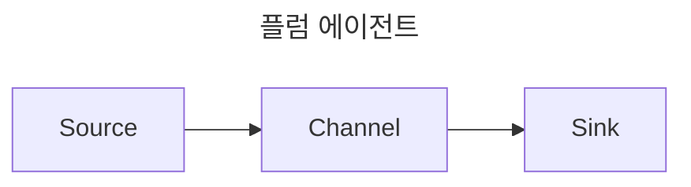
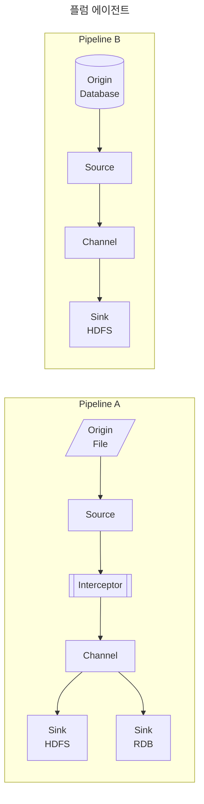
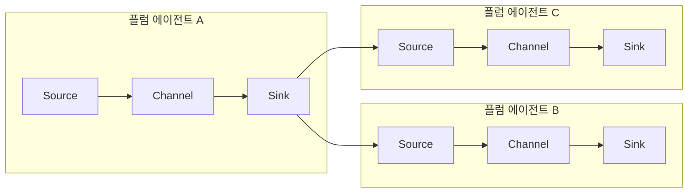
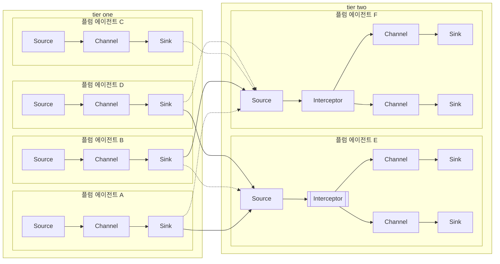

# [Flume](https://flume.apache.org/)

## 개요

원천의 다양한 데이터(파일, DB, API, Socket 등)들을 수집할때 프로토콜, 메세지 포맷, 발생주기, 데이터 크기 등을 고민해야 함   
이를 편리하게 지원해주며 적재까지 지원해줌

- 라이센스 - Apache 2.0
- 유사 프로젝트 - Fluented, Scribe, Logstash, Chukwa, NiFi, Embulk ...

| 컴포넌트 | 설명 |
| --- | --- |
| Source | 다양한 원천 시스템의 데이터를 수집하기 위해 Avro, Thrift, JMS, Spool Dir, Kafka 등 여러 주요 컴포넌트를 제공  수집한 데이터를 Channel로 전달 |
| Sink | 수집한 데이터를 Channel로 부터 전달받아 최종 목적지에 저장하기 위한 기능 HDFS, Hive, Logger, Avro, ElasticSearch, Thrift 등을 제공 |
| Channel | Source와 Sink를 연결하며, 데이터를 버퍼링하는 컴포넌트 메모리, 파일, 데이터베이스를 채널의 저장소로 활용 |
| Interceptor | Source와 Channel 사이에서 데이터 필터링 및 가공하는 컴포넌트 Timestamp, Host, Regex Filtering 등을 기본 제공하며, 필요 시 사용자 정의 Interceptor를 추가 |
| Agent | Source -> (Interceptor) -> Channel -> Sink 컴포넌트 순으로 구성된 작업 단위로 독립된 인스턴스로 생성 |

## 아키텍처

### 유형1

가장 기본적인 데이터 파이프라인 구성

### 유형2

하나의 에이전트 안에서 동시에 두개의 원천 데이터를 기준으로 파이프라인 구축 가능

싱크를 병렬로 구성해 하나는 하둡 HDFS, 하나는 RDB에 저장하도록 구성 가능

### 유형3

데이터 유형에 따라 에이전트 B, 에이전트 C로 데이터 파이프라인 라우팅 처리

처리 속도를 늘릴 수 있는 장점

### 유형4

티어 one 에서 대규모 데이터를 처리할 수 있는 구조를 가져가고  
티어 two 에서 비즈니스적으로 복합적인 처리가 필요할 때 가져갈 수 있는 아키텍쳐

대규모 데이터에 대한 안정성도 가져가고 비즈니스적인 로직이 복잡하게 발생할때 사용하는 아키텍쳐

