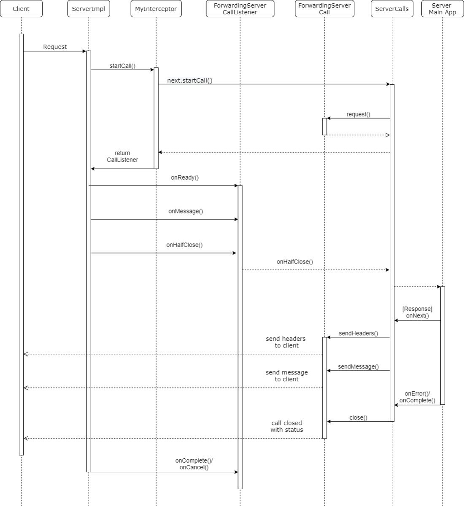
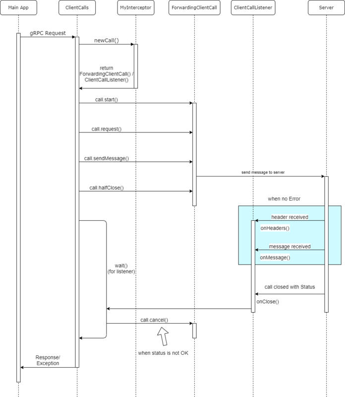

# gRPC 고급기능

## 인터셉터

[Introduction to Java gRPC Interceptor](https://engineering.kabu.com/entry/2021/03/31/162401)

### 서버 인터셉터

1. Call - request
2. CallListener - onReady
3. CallListener - onMessage
4. CallListener - onHalfClose
5. Call - sendHeaders
6. Call - sendMessage
7. Call - close
8. CallListener - onComplete

### 클라이언트 인터셉터

1. Call - start
2. Call - request
3. Call - sendMessage
4. Call - halfClose
5. CallListener - onReady
6. CallListener - onHeaders
7. CallListener - onMessage
8. CallListener - onClose

## 데드라인
