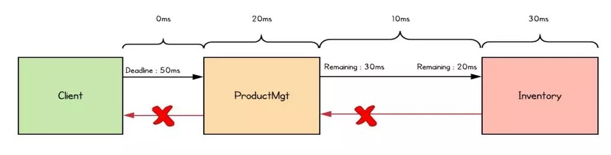

# gRPC 고급기능

## 인터셉터

[Introduction to Java gRPC Interceptor](https://engineering.kabu.com/entry/2021/03/31/162401)

### 서버 인터셉터

1. Call - request
2. CallListener - onReady
3. CallListener - onMessage
4. CallListener - onHalfClose
5. Call - sendHeaders
6. Call - sendMessage
7. Call - close
8. CallListener - onComplete

### 클라이언트 인터셉터

1. Call - start
2. Call - request
3. Call - sendMessage
4. Call - halfClose
5. CallListener - onReady
6. CallListener - onHeaders
7. CallListener - onMessage
8. CallListener - onClose

## [데드라인](https://grpc.io/docs/guides/deadlines/)

하나의 요청이 하나 이상의 서비스를 함께 묶는 여러 다운스트림(downstream) RPC로 구성시 요청 전체 수명주기에 데드라인 적용  
요청 시작 어플리케이션이 데드라인을 설정하면 전체 요청 체인은 데드라인까지 응답해야 한다  

데드라인 없을시 PRC 요청에 대한 응답을 무한정 기다리며, 리소스가 유지된다  
이로인해 서비스는 물론 클라이언트도 리소스가 부족해질 수 있으므로 서비스 대기 시간이 길어지게 되며, 결국 전체 gRPC 서비스가 중단될 수도 있다

데드라인 오프셋(데드라인 = 현재 시간 + 오프셋)을 50ms 설정  
데드라인 이벤트가 두 클라이언트(재고 관리 서비스(Inventory)를 호출하는 ProductMgt와 클라이언트 어플리케이션) 측에서 발생한다  
ProductMgt 서비스의 호출 로직은 데드라인 초과 시나리오를 발생시키고 이를 클라이언트 어플리케이션으로 다시 전달한다  
따라서 데드라인을 사용하는 경우 데드라인은 전체 호출 서비스에 적용된다  

클라이언트 어플리케이션은 gRPC 서비스를 처음 연결할 때 데드라인을 설정  
DEADLINE_EXCEEDED 에러와 함께 RPC 호출 종료  

gRPC 데드라인과 관련해 클라이언트, 서버 모두 RPC의 성공 여부에 대해 독립적이고 개별적인 결정을 내릴 수 있다, 이는 결과가 서로 다를 수 있다는 것  
클라이언트가 DEADLINE_EXCEEDED 상태가 되더라도 서비스는 여전히 응답을 시도할 수 있다  
그래서 서비스 어플리케이션은 현재 RPC가 여전히 유효한지 아닌지를 확인해야 한다  
서버에서 클라이언트가 RPC를 호출할 때 지정된 데드라인이 초과됐는지 감지할 수 있다  

[gRPC examples DeadlineClient](https://github.com/grpc/grpc-java/blob/master/examples/src/main/java/io/grpc/examples/deadline/DeadlineClient.java)
