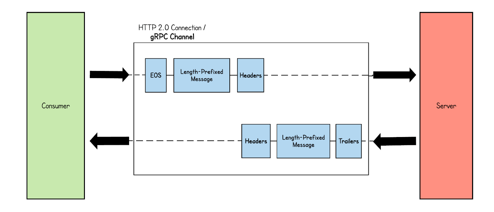
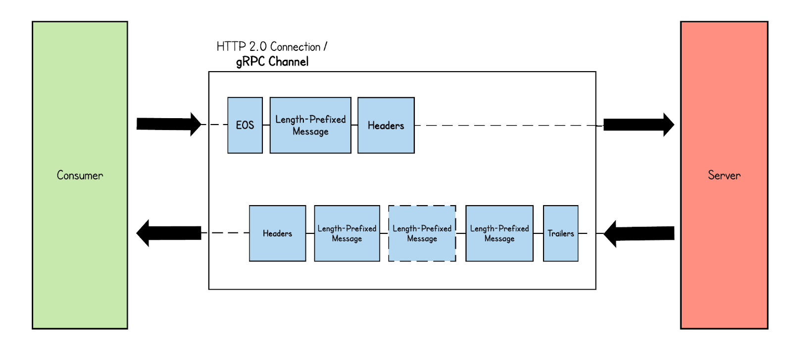
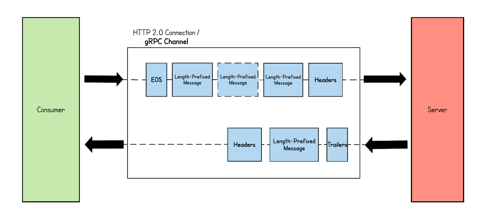
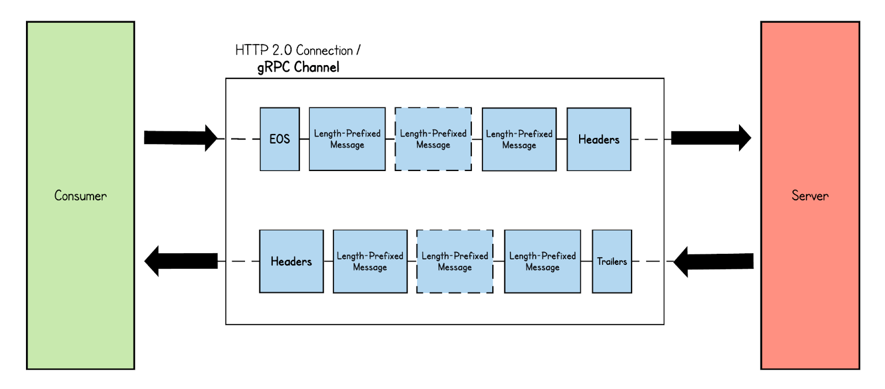

# gRPC 통신 패턴

[gRPC: A Deep Dive into the Communication Pattern
](https://thenewstack.io/grpc-a-deep-dive-into-the-communication-pattern/)

## Unary RPC

단순 RPC (단일 RPC)

클라이언트가 서버의 원격 기능을 호출하고자 단일 요청을 서버로 보내고 상태에 대한 세부 정보 및 후행(trailing) 메타데이터와 함께 단일 응답을 받는다  

> This is the simplest communication pattern by gRPC. Here, the client sends a single message to the server and receives a single message. As shown in the figure below, inside the stream, only one binary message is going in both request and response.

## Server Streaming RPC

서버 스트리밍 RPC

서버가 클라이언트의 요청 메세지를 받은 후 일련의 응답을 다시 보낸다, 일련의 응답을 '스트림' 이라 한다  
모든 서버 응답을 보낸 후에 서버는 서버의 상태 정보를 후행 메타데이터로 클라이언트에 전송해 스트림의 끝을 알린다  
클라이언트가 전송한 단일 요청에 대해 여러 응답 메세지를 수신하는 것  

> Unlike in the simple RPC pattern, in server-streaming RPC, the server sends back a sequence of responses when a request is received from the client. This sequence of response messages are sent inside the same HTTP stream initiated by the client. As shown in the diagram below, the server waits until it receives the message from the client and sends multiple response messages as framed messages. At the end, the server concludes the stream by sending the trailing metadata with the call status details.

## Client Streaming RPC

클라이언트 스트리밍 RPC

클라이언트가 하나의 요청이 아닌 여러 메세지를 서버로 보내고, 서버는 클라이언트에게 단일 응답을 보낸다  
그러나 서버는 클라이언트에서 모든 메세지를 수신해 응답을 보낼 때까지 기다릴 필요는 없다  
필요한 로직에 따라 스트림에서 하나 또는 여러 개의 메세지를 읽은 후 또는 모든 메세지를 읽은 후 응답을 보낼 수 있다  

> In the client-streaming RPC pattern, the client sends multiple messages to the server and the server sends only one message in return. Similar to the patterns discussed above, all these messages are passed inside one HTTP stream initiated by the client. The figure below illustrates how multiple messages flow through the stream. This stream can last until the end of RPC.

## Bidirectional Streaming RPC

양방향 스트리밍 RPC

클라이언트 메세지는 스트림으로 서버에 요청을 보내고, 서버는 메세지 스트림으로 응답한다  
호출은 클라이언트에서 시작하지만 그 후 통신은 gRPC 클라이언트와 서버의 어플리케이션 로직에 따라 완전히 다르다  

> In bidirectional streaming RPC, both the client and server send a stream of messages to each other. The client sets up the HTTP stream by sending header frames. Once the connection is set up, both the client and server can send messages simultaneously without waiting for the other to finish. The communication happens based on the logic of the gRPC client and server.
