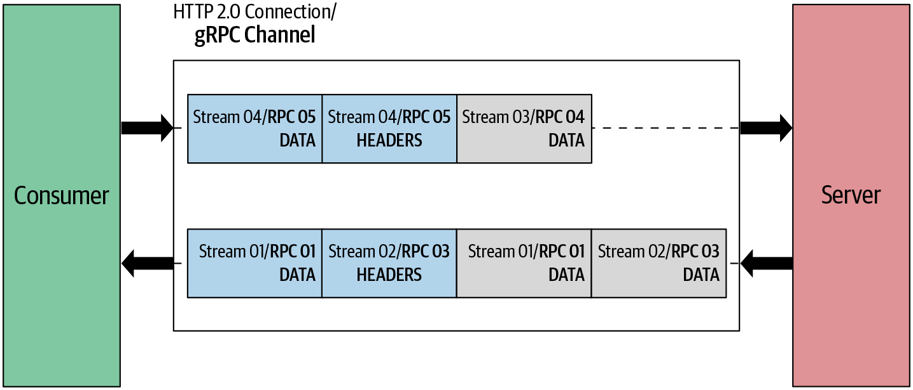

# HTTP/2를 통한 gRPC

[gRPC doc - Protocol HTTP/2](https://github.com/grpc/grpc/blob/master/doc/PROTOCOL-HTTP2.md)

gRPC는 HTTP/2를 전송 프로토콜로 사용해 네트워크를 통해 메세지를 보냄  

HTTP/2에서 클라이언트 서버 간의 모든 통신은 단일 TCP 연결을 통해 처리됨  
이는 임의의 크기의 양방향 바이트 흐름을 전달할 수 있다  

작은 단위로부터 `프레임 -> 메세지 -> 스트림` 구성 순서
- 프레임: HTTP/2에서 가장 작은 통신 단위, 각 프레임에는 프레임 헤더가 포함돼 있으며 헤더를 통해 프레임이 속한 스트림을 식별한다  
- 메세지: 하나 이상의 프레임으로 구성된 논리적 HTTP 메세지에 매핑되는 온전한 프레임 시퀀스  
  이는 클라이언트와 서버가 메세지를 독립 프레임으로 분류하고 interleave한 후 다른 쪽에서 다시 조립할 수 있는 메세지 multiplexed를 지원한다  
- 스트림: 설정된 연결에서의 양방향 바이트 흐름이며, 스트림은 하나 이상의 메세지를 전달 할 수 있다  



클라이언트 어플리케이션이 gRPC 채널을 만들면 내부적으로 서버와 HTTP/2 연결을 만드는데, 채널이 생성되면 서버로 여러 개의 연격 호출을 보낼 수 있도록 재사용된다  
이 원격 호출은 HTTP/2 스트림으로 처리되며, 원격 호출로 전송된 메세지는 HTTP/2 프레임으로 전송된다  
그리고 프레임은 하나의 gRPC 길이-접두사 지정 메세지를 보내거나 gRPC 메세지가 상당히 큰 경우 여러 데이터 프레임에 걸쳐 보내진다  

## 요청 메세지


요청 메세지는 `요청 헤더`, `길이-접두사 지정 메세지`, `스트림 종료 플래그` 세 가지 주요 요소로 구성된다

클라이언트가 `요청 헤더`를 보내면 원격 호출이 시작되고 `길이-접두사 지정 메세지`가 해당 호출로 전송된다  
마지막으로 `스트림 종료(EOS, End Of Stream) 플래그`가 전송돼 수신자에게 요청 메세지 전송이 완료되었음을 알린다  

Example

ProductInfo 서비스의 getProduct 함수를 사용해 요청 메세지가 HTTP/2 프레임으로 전송되는 방법

```
HEADERS (flags = END_HEADERS)
:method = POST                   // HTTP 메서드를 정의. gRPC의 경우 :method 헤더는 항상 POST가 된다
:scheme = http                   // HTTP 스키마를 정의 TLS(Transport Level Security)가 활성화된 경우 스키마는 https
:path = /ProductInfo/getProduct  // 엔드포인트 경로를 정의. gRPC의 경우 "/" {service name} "/" {method name} 로 구성
:authority = abc.com             // 대상 URI의 가상(virtual) 호스트 이름을 정의
te = trailers                    // 호환되지 않는 프록시 탐지를 정의. gRPC의 경우 "trailers"여야 한다
grpc-timeout = 1S                // 호출 타임아웃을 정의. 지정하지 않으면 서버는 무한 타임아웃으로 가정
content-type = application/grpc  // 컨텐츠 타입 정의. gRPC의 경우 콘텐츠 타입은 application/grpc로 시작해야한다. 그렇지 않으면 HTTP status of 415 응답 (Unsupported Media Type)
grpc-encoding = gzip             // 메세지 압축 유형 정의. 가능한 값은 identity, gzip, deflate, snappy, {custom}이다
authorization = Bearer xxxxxx    // 선택적 메타데이터 정의. authorization 메타데이터는 보안이 요구되는 엔드포인트에 액세스하는 데 사용된다  
```

> - ":"으로 시작하는 헤더 이름은 예약 헤더(reserved headers)로, HTTP/2에서는 예약 헤더가 다른 헤더보다 앞에 나온다
> - 헤더 두 가지 유형, 통신 정의(call-definition) 헤더와 사용자 정의(custom) 메타데이터로 분류
> - Call-definition 헤더는 사용자 정의 메타데이터보다 먼저 전송되어야 한다
> - 사용자 정의 메타데이터를 정의할 때는 grpc- 로 시작하는 헤더 이름을 사용하지 않아야 한다 (gRPC 코어에서 예약된 이름으로 처리되기 때문)

길이-접두사 지정 메세지가 하나의 데이터 프레임에 맞지 않으면 여러 데이터 프레임으로 분리된다  
요청 메세지의 마지막은 최동 DATA 프레임에 END_STREAM 플래그를 추가해 표시한다  
전송할 데이터가 없으면서 요청 스트림을 종료해야 하는 경우 구현은 END_STREAM 플래그를 사용해 다음과 같은 빈 데이터 프레임을 보낸다  

```
DATA (flags = END_STREAM)
<Length-Prefixed Message>
```
