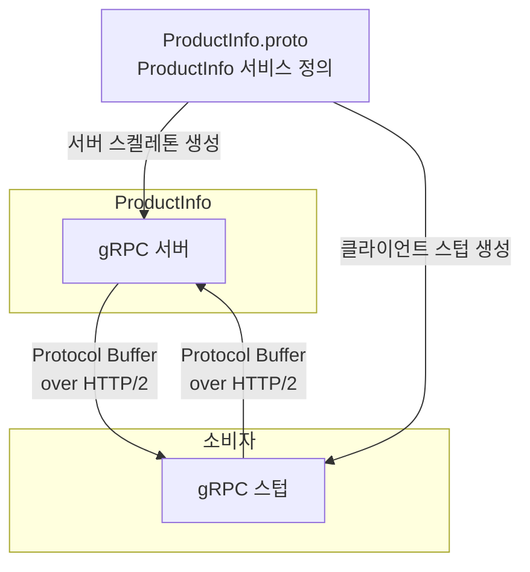

[gRPC Up and Running](https://grpc-up-and-running.github.io/)

## 서비스 정의

```mermaid
flowchart TD
    SVC[ProductInfo.proto\nProductInfo 서비스 정의]

    GSV[gRPC 서버]
    GST[gRPC 스텁]

    GST --Protocol Buffer\nover HTTP/2--> GSV
    GSV --Protocol Buffer\nover HTTP/2--> GST

    SVC --서버 스켈레톤 생성--> GSV
    SVC --클라이언트 스텁 생성--> GST

    subgraph 소비자
        GST
    end

    subgraph ProductInfo
        GSV
    end
```
