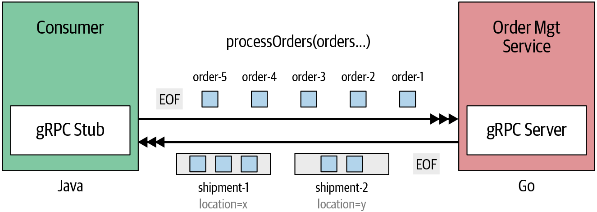

# [gRPC Up & Running](https://grpc-up-and-running.github.io/)

## ProductInfo 서비스 정의

## OrderManagement 서비스 정의

### processOrders

연속된 주문 세트(주문 스트림)를 전송하고 배송 위치를 기준으로 주문들을 결합한 발송(shipment)으로 처리하는 주문 처리 기능

이 유스케이스의 중요한 아이디어는 일단 RPC 메서드가 호출되면 클라이언트나 서비스가 임의의 시간에 메시지를 보낼 수 있다
이 유스케이스를 구성하는 주요 단계는 다음과 같다

- 클라이언트 어플리케이션은 서버와의 연결을 설정하고 호출에 대한 메타데이터(헤더)를 전송해 비즈니스 유스케이스를 시작한다
- 연결 설정이 완료되면 클라이언트 어플리케이션은 처리해야 하는 연속된 주문 ID 세트를 OrderManagement 서비스에 보낸다
- 각 주문 ID는 별도의 gRPC 메세지로 서버에 전송한다
- 서비스는 지정된 주문 ID에 대한 각 주문을 처리하고 주문의 배달 위치에 따라 주문을 결합된 발송(shipment)으로 구성한다
- 결합된 발송에는 동일한 목적지로 전달돼야 하는 여러 주문이 포함될 수 있다
- 주문은 배치 방식으로 처리되는데, 배치 크기에 도달하면 현재 생성된 모든 결합된 발송을 클라이언트에 다시 전송한다
- 예를 들어 위치 X로 보내져야 할 2개의 주문과 위치 Y로 보내질 2개의 주문이 X, Y, X, Y 순서로 스트림되고, 배치 크기가 3이라고 하면 주문은 배송 [X,X], 배송 [Y], 배송 [Y]로 결합된다  
  그리고 결합된 발송은 클라이언트 스트림으로 다시 전송된다  
  - 배치 크기는 주문을 배송으로 묶고자 한 번에 처리되는 주문의 크기
  - 따라서 X, Y, X 주문이 스트림된 시점에 배송 [X,X], 배송 [Y]로 처리되고, 나머지 Y 주문이 스트림된 시점에 배송 [Y]가 처리됨
