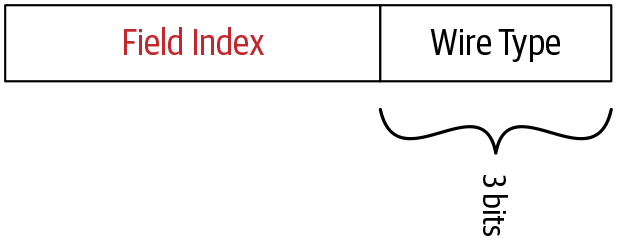

# 프로토콜 버퍼 인코딩

[Protocol Buffers Documentation](https://protobuf.dev/)

프로토콜 버퍼는 구조화된 데이터를 직렬화하기 위한 언어에 구애 받지 않고 플랫폼 중립적이며 확장 가능한 메커니즘을 갖는다


값 필드의 필드 식별자와 인코딩된 값으로 구성, 이 필드 식별자는 태그(tag)라고도 한다

각 메세지 필드는 필드 식별자와 인코딩된 값으로 구성

스트림의 끝은 0이라는 태그 값을 전송해 표시한다

이 태크들은 필드 인덱스와 와이어 타입(wire type)의 두 가지 값으로 구성된다

- 필드 인덱스 - 프로토 파일에서 메세지를 정의할 때 각 메세지 필드에 할당된 고유 번호
- 와이어 타입 - 필드가 가질 수 있는 데이터 타입인 필드 타입을 기반으로 하는데, 값의 길이를 찾기 위한 정보를 제공

[Encoding](https://protobuf.dev/programming-guides/encoding/)

| 와이어 타입 | 종류                       | 필드 타입                                                     |
|--------|--------------------------|-----------------------------------------------------------|
| 0      | 가변 길이 정수 (Varint)        | int32, int64, uint32, uint64, sint32, sint64, bool, enum  |
| 1      | 64비트                     | fixed64, sfixed64, double                                 |
| 2      | 길이 구분 (Length-delimited) | string, bytes, embedded message, packed, repeated, fields |
| 3      | 시작 그룹 (Start group)      | groups (사용 중단)                                            |
| 4      | 종료 그룹 (End group)        | groups (사용 중단)                                            |
| 5      | 32비트                     | fixed32, sfixed32, float                                  |

와이어 타입에 매핑되는 필드 타입, 사전에 정의된 와이어와 필드 타입에 대한 매핑

필드 인덱스와 와이어 타입이 태그 값으로 배치되는 방법



필드의 태그 값 결정

```
Tag Value = (field_index << 3) | wire_type
```

Example

```
message ProductID {
    string value = 1;
}
```

필드 인덱스가 1인 문자열 필드가 하나, 이 와이어 타입은 2

```
Tag value = (0000 0001 << 3) | 0000 0010
          = 000 1010
          = 8 + 2
          = 10
```

계산 결과 태그 값 10

프로토콜 버퍼 인코딩에서 문자열 값은 UTF-8 인코딩 사용  
ProductID 메세지의 value 필드 값이 15일 경우  
UTF-8 인코딩 값 15는 0x31 0x35

UTF-8 인코딩에서는 인코딩된 값의 길이는 고정되지 않는다  
인코딩된 값을 나타내는 데 필요한 8비트 블록의 수는 고정돼 있지 않고, 메세지 필드의 값에 따라 다르다

최종적으로 인코딩된 값 15의 16진수 표현

```
A 02 31 35
```

| A         | 02                            | 31 35         |
|-----------|-------------------------------|---------------|
| Tag Value | 인코딩 된 문자열 값의 길이를 8비트 블록으로 나타냄 | 인코딩 된 필드 값 15 |

## 인코딩 기술

### 가변 길이 정수

Varints (variable length integers)

하나 이상의 바이트를 사용해 정수를 직렬화하는 방법  
대부분의 숫자가 균등하게 분포돼 있지 않다는 아이디어를 기반으로 한다  
따라서 각 값에 할당된 바이트 수는 고정돼 있지 않고 값에 따라 다르다

| 필드 타입  | 정의                                                                                                                                 |
|--------|------------------------------------------------------------------------------------------------------------------------------------|
| int32  | range from negative 2,147,483,648 to positive 2,147,483,647</br>부호 있는 정수를 나타내는 값 타입, 음수 인코딩하는데 비효율적                                |
| int64  | range from negative 9,223,372,036,854,775,808 to positive 9,223,372,036,854,775,807</br>부호 있는 정수를 나타내는 값 타입, 음수 인코딩하는데 비효율적        |
| uint32 | range from 0 to 4,294,967,295</br>부호 없는 정수를 나타내는 값 타입                                                                              |
| uint64 | range from 0 to 18,446,744,073,709,551,615</br>부호 없는 정수를 나타내는 값 타입                                                                 |
| sint32 | range from negative 2,147,483,648 to positive 2,147,483,647</br>부호 있는 정수를 나타내는 값 타입, int32보다 음수를 효율적으로 인코딩                         |
| sint64 | range from negative 9,223,372,036,854,775,808 to positive 9,223,372,036,854,775,807</br>부호 있는 정수를 나타내는 값 타입, int64보다 음수를 효율적으로 인코딩 |
| bool   | 일반적으로 true, false로 표시되는 두 가지 가능한 값을 나타내는 값 타입                                                                                      |
| enum   | 이름이 있는 값의 집합을 나타내는 값 타입                                                                                                            |

마지막 바이트를 제외한 각 바이트에 앞으로 더 많은 바이트가 있음을 나타내고자 최상위 비트(MSB, Most Significant Bit)가 1이 된다  
각 바이트의 하위 7비트는 해당 수에 대한 2의 보수(two's complement) 표현으로 저장  
최하위 비트(Least Significant Bit)가 먼저 나오기 때문에 하위 그룹(low-order-group)에 연속 비트(continuation bit)를 추가해야 한다

Example

300을 가변 길이 정수로 전송하는 예

```
1010 1100 0000 0010
```

첫 번째 바이트의 최상위 비트가 1이기 때문에 다음 바이트까지 하나의 정수가 저장되고,  
하위 7비트만 사용하기 때문에 다음과 같이 변경된다

```
010 110 000 0010
```

그리고 최하위 그룹이 먼저 나왔다는 것은  
바이트를 기준으로 뒤에 있는 바이트가 수의 앞부분(큰 수 부분)을 나타낸다는 것으로,  
2개의 바이트 순서를 다음과 같이 변경한다

```
000 0010 010 1100
```

이를 10진수로 변경하면 다음과 같다

```
000 0010 010 1100

256 + 32 + 8 + 4 = 300
```

### 부호 있는 정수

Signed integers

양수와 음수를 모두 갖는 타입 sint32 sint64 같은 필드 타입이 부호 있는 정수로 간주된다

부호 있는 타입의 경우 Zigzag 인코딩이 부호 있는 정수를 부호 없는 정수로 변환하는데 사용  
변환한 다음에는 부호 없는 정수는 앞서 언급한 가변 길이 정수 인코딩 방법을 사용해 인코딩된다  
지그재그 인코딩에서 부호 있는 정수는 음과 양이 정수를 지그재그 방식으로 부호 없는 정수로 매핑시킨다  

원래 음의 값은 홀수 양수로 매핑, 원래 양의 값은 짝수 양으로 매핑  
얻어진 양수는 가변 길이 정수로 인코딩한다

| 원래 값 | 매핑된 값 |
|------|-------|
| 0    | 0     |
| -1   | 1     |
| 1    | 3     |
| -2   | 4     |
| 2    | 5     |
*지그재그 인코딩에서 매핑이 작동하는 방식*

int32, int64와 같은 일반 타입을 사용하는 경우 음수는 가변 길이 인코딩을 사용해 바이너리로 변환되기 때문에  
음의 정수는 sint32, sint64와 같은 부호 있는 정수 타입을 사용하는 것이 좋다  
음의 정수에 대한 가변 길이 정수 인코딩은 양의 정수보다 같은 바이너리 값을 나타내고자 더 많은 바이트가 필요하다  
따라서 음수 값을 인코딩하는 효율적인 방법은 음수 값을 양수로 변환한 다음 양수 값을 인코딩하는 것이다  
(일반 타입의 음의 정수는 정해진 바이트의 맨 앞 비트가 1이 되기 때문에 크기와 상관없이 전체 바이트를 모두 사용해야 한다)  

### 비가변 길이 정수

Nonvarint numbers

실제 값에 관계없이 고정된 바이트 수를 할당한다  
프로토콜 버퍼는 비가변 길이 정수로 분류되는 두 가지 와이어 타입을 사용  
fixed64, sfixed64, double과 같은 64비트 데이터 타입  
fixed32, sfixed32, float과 같은 32비트 데이터 타입  

### 문자열 타입

String type

프로토콜 버퍼에서 문자열 타입은 길이로 구분(length-delimited)된 와이어 타입에 속한다  
즉, 지정된 바이트 수의 데이터가 뒤따르는 가변 길이 정수 인코딩 크기를 갖는다  
문자열은 UTF-8 문자 인코딩을 사용해 인코딩된다  
