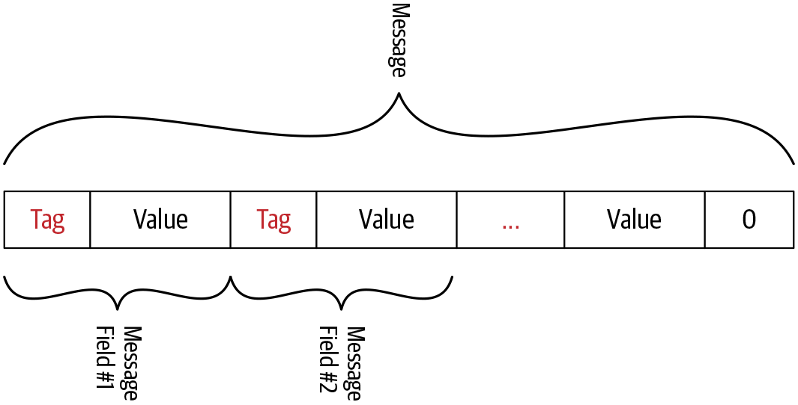

# 프로토콜 버퍼 인코딩

[Protocol Buffers Documentation](https://protobuf.dev/)

프로토콜 버퍼는 구조화된 데이터를 직렬화하기 위한 언어에 구애 받지 않고 플랫폼 중립적이며 확장 가능한 메커니즘을 갖는다



값 필드의 필드 식별자와 인코딩된 값으로 구성, 이 필드 식별자는 태그(tag)라고도 한다

각 메세지 필드는 필드 식별자와 인코딩된 값으로 구성

스트림의 끝은 0이라는 태그 값을 전송해 표시한다

이 태크들은 필드 인덱스와 와이어 타입(wire type)의 두 가지 값으로 구성된다

- 필드 인덱스 - 프로토 파일에서 메세지를 정의할 때 각 메세지 필드에 할당된 고유 번호
- 와이어 타입 - 필드가 가질 수 있는 데이터 타입인 필드 타입을 기반으로 하는데, 값의 길이를 찾기 위한 정보를 제공

[Encoding](https://protobuf.dev/programming-guides/encoding/)

| 와이어 타입 | 종류                       | 필드 타입                                                     |
|--------|--------------------------|-----------------------------------------------------------|
| 0      | 가변 길이 정수 (Varint)        | int32, int64, uint32, uint64, sint32, sint64, bool, enum  |
| 1      | 64비트                     | fixed64, sfixed64, double                                 |
| 2      | 길이 구분 (Length-delimited) | string, bytes, embedded message, packed, repeated, fields |
| 3      | 시작 그룹 (Start group)      | groups (사용 중단)                                            |
| 4      | 종료 그룹 (End group)        | groups (사용 중단)                                            |
| 5      | 32비트                     | fixed32, sfixed32, float                                  |

와이어 타입에 매핑되는 필드 타입, 사전에 정의된 와이어와 필드 타입에 대한 매핑

필드 인덱스와 와이어 타입이 태그 값으로 배치되는 방법


필드의 태그 값 결정

```
Tag Value = (field_index << 3) | wire_type
```

Example

```
message ProductID {
    string value = 1;
}
```

필드 인덱스가 1인 문자열 필드가 하나, 이 와이어 타입은 2

```
Tag value = (0000 0001 << 3) | 0000 0010
          = 000 1010
          = 8 + 2
          = 10
```

계산 결과 태그 값 10

프로토콜 버퍼 인코딩에서 문자열 값은 UTF-8 인코딩 사용  
ProductID 메세지의 value 필드 값이 15일 경우  
UTF-8 인코딩 값 15는 0x31 0x35

UTF-8 인코딩에서는 인코딩된 값의 길이는 고정되지 않는다  
인코딩된 값을 나타내는 데 필요한 8비트 블록의 수는 고정돼 있지 않고, 메세지 필드의 값에 따라 다르다

최종적으로 인코딩된 값 15의 16진수 표현

```
A 02 31 35
```

| A         | 02                            | 31 35         |
|-----------|-------------------------------|---------------|
| Tag Value | 인코딩 된 문자열 값의 길이를 8비트 블록으로 나타냄 | 인코딩 된 필드 값 15 |

