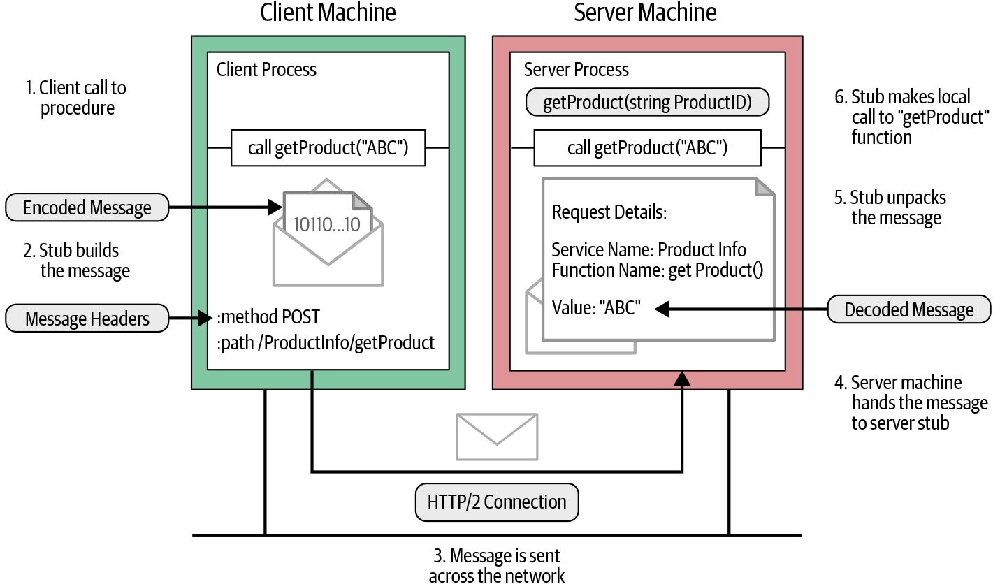

# RPC 흐름

1. 클라이언트 프로세스는 생성된 스텁에 있는 getProduct 함수 호출
2. 클라이언트 스텁은 인코딩 메세지로 HTTP POST 요청 생성  
  gRPC에서는 모든 요청이 application/grpc 접두어가 붙는 Content-Type을 가진 HTTP POST 요청이다
  호출하는 원격 함수(ProductInfo/getProduct)는 별도의 HTTP 헤더로 전송  
3. HTTP 요청 메세지는 네트워크를 통해 서버 머신으로 전송
4. 서버에 메세지가 수신되면 서버는 메세지 헤더를 검사해 어떤 서비스 함수를 호출해야 하는지 확인
  메세지를 서비스 스텁에 넘긴다  
5. 서비스 스텁은 메세지 바이트를 언어별 데이터 구조로 파싱
6. 그런 다음 파싱된 메세지를 사용해 서비스는 getProduct 함수로 로컬로 호출한다
7. 서비스는 함수의 응답이 인코딩돼 클라이언트로 다시 전송  
  응답 메세지는 클라이언트에서와 동일한 절차를 따른다(응답 -> 인코딩 -> HTTP 응답)  
  메세지가 복원돼 해당 값이 대기 중인 클라이언트 프로세스로 반환된다  
