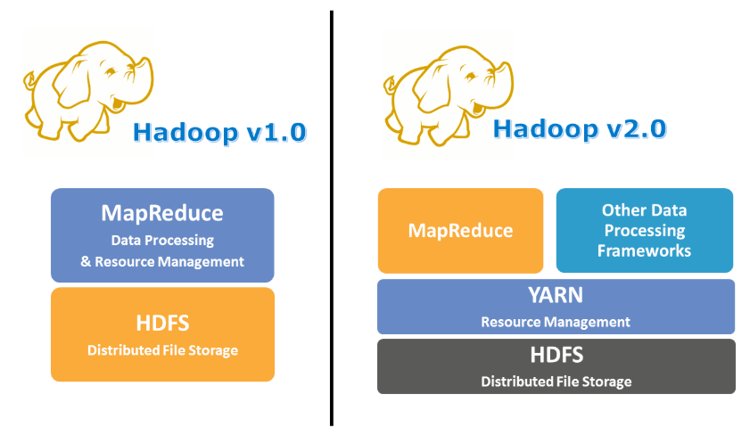
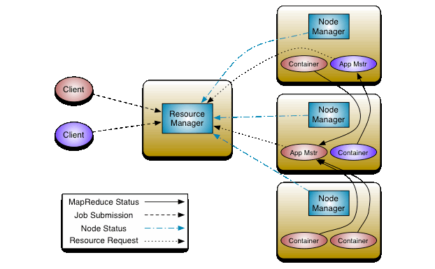

# YARN (Yet Another Resource Negotiator)

## [Architecture](https://hadoop.apache.org/docs/stable/hadoop-yarn/hadoop-yarn-site/YARN.html)

YARN은 수십, 수백 개의 노드로 구성된 Hadoop 클러스터에서 실행되는 수 많은 작업 Task들을 관리 및 스케쥴링하고 각각의 작업에 사용될 자원을 적절히 분산하여 관리해주는 기능을 수행.  
여기서 말하는 자원은 Hadoop 클러스터의 모든 장비들의 CPU 코어 수와 Memory 크기를 합친 클러스터의 총 CPU 코어와 총 Memory 크기.

Yarn과 HDFS 자체는 완전히 독립적이다. HDFS는 storage 기능 제공, Yarn은 application을 구동하는 기능 제공

The fundamental idea of YARN is to split up the functionalities of resource management and job scheduling/monitoring into separate daemons.  
The idea is to have a global ResourceManager (RM) and per-application ApplicationMaster (AM).  
An application is either a single job or a DAG of jobs.

## 구성

Yarn의 Architecture는 크게 세 가지 역할을 하는 컴포넌트로 구성

### Resource Manager (RM)
- Node Manager의 Primary? Master? 서버 역할
- Yarn이 동작한다는 것은 하나의 Resource Manager가 존재한다는 것 
- 모든 Node의 Resource + Rack Awareness 를 체크하고 있음
- 구성 컴포넌트
  - Scheduler
    - 리소스 할당을 어떻게 할지 지정
    - 어플리케이션의 리소스 요구사항을 기반으로 한 기능만 수행
      - 어플리케이션 상태 모니터링 X
      - 어플리케이션의 장애, restart 관여 X
  - Applications Manager (AM)
    - 제출된 어플리케이션 리스트 관리 
    - Application Master가 뜰 첫번째 컨테이너를 선정
    - 장애에 대해 Application Master container를 재시작하는 역할
  
### Application Master 
- 하나의 Application이 리소스를 할당 받으면서 부터 생성
- Job에서 가장 먼저 시작하는 컨테이너, 즉 Job의 라이프사이클을 관리
- RM과 지속적 통신하면서 리소스 요청 및 할당 받
- Node Manager와 지속적 통신하면서 컨테이너에 관련된 정보 교환
  
### Node Manager
- 데이터 노드에서 노드 매너저 역할 
- RM 입장에서 Node Manager는 Worker Node 로서의 역할을 수행
- HeartBeat와 함께 해당 노드에서 점유하고 있는, 가용할 수 있는 리소스 RM에게 전달 
