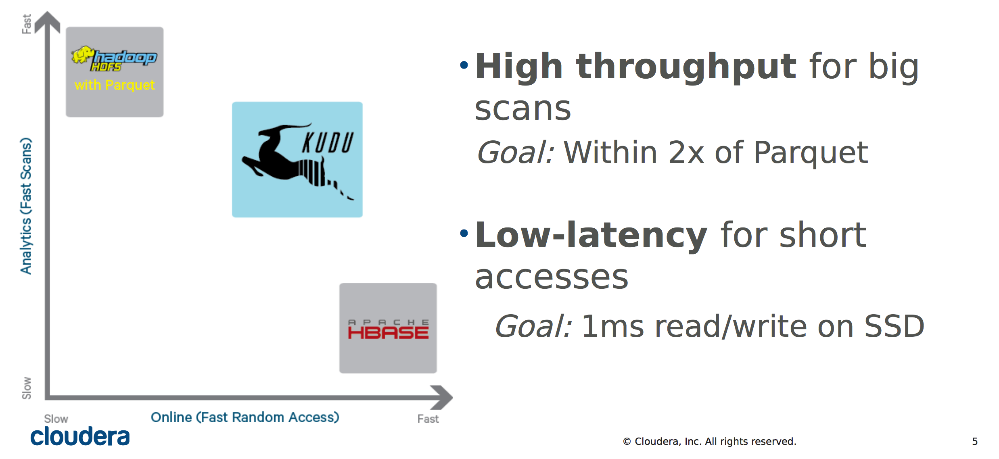
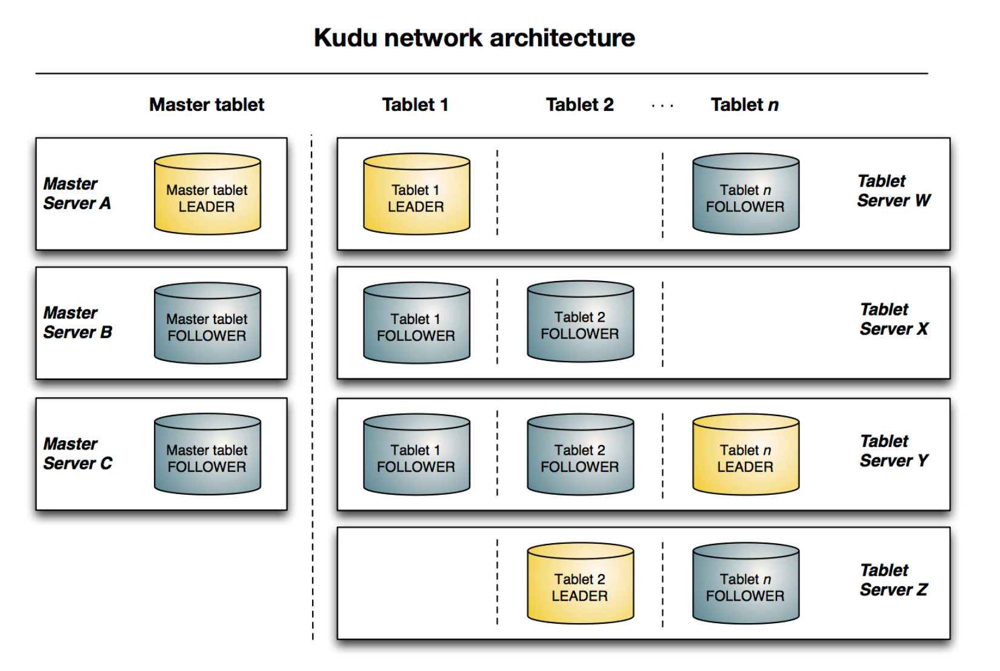

# Kudu

https://kudu.apache.org/

https://impala.apache.org/docs/build/asf-site-html/topics/impala_intro.html

[github - kudu](https://github.com/apache/kudu)

https://sencia.tistory.com/43

https://d2.naver.com/helloworld/9099561

## 특징

### 저장

Kudu는 순차 읽기와 랜덤 액세스를 모두 잘하는 플랫폼이라는 것을 알 수 있다.

- 데이터가 칼럼 기반으로 저장돼 있어 특정 칼럼만 읽을 때는 디스크에서 읽는 양을 획기적으로 줄여 성능을 높일 수 있다는 점이다. 다른 칼럼 기반 스토리지인 Parquet와 다르게 테이블을 생성할 때 각 칼럼마다 압축 방식과 인코딩 방식을 사용자가 지정할 수 있다.
- 일반 DBMS처럼 primary key를 제공해 랜덤 액세스 속도가 매우 빠르다는 점이다. Kudu의 primary key는 내부적으로 B+ 트리로 저장돼 있어 대규모 데이터에서도 primary key를 사용해 매우 빠르게 데이터에 접근할 수 있다.
- Parquet와 비슷하게 대규모 순차 읽기(sequential reading)에 매우 최적화돼 있다는 점이다. 데이터가 Bit-packing 방식이나 Run-length 방식을 사용해 효율적으로 인코딩돼 있기 때문에 순차 읽기 속도가 빠르다.

### 질의 처리




- Parquet는 순차 읽기에 강하나 랜덤 액세스에는 약하다.  
- HBase는 랜덤 액세스에는 강하나 순차 읽기에는 약하다.  
- Kudu는 순차 읽기와 랜덤 액세스를 모두 잘한다.  

그래서 다음 그림처럼 Hadoop 에코 시스템에서 Parquet와 HBase 사이에 위치한다. 테스트에서도 Parquet와 HBase 사이의 간극을 메운다는 것을 확인할 수 있었다.



HBase와 비슷하게 마스터 서버가 카탈로그 역할을 하고 각 태블릿(tablet) 서버가 각자의 태블릿을 저장하는 구조다. 태블릿이 실제 데이터를 저장하고 있는 파일이다.


## Example

- java
  - https://github.com/apache/kudu/blob/master/examples/java/java-example/README.adoc

## HDFS?

[Why doesn’t Kudu store its data in HDFS?](https://kudu.apache.org/faq.html#why-doesnt-kudu-store-its-data-in-hdfs)

We considered a design which stored data on HDFS, but decided to go in a different direction, for the following reasons:

- Kudu handles replication at the logical level using Raft consensus, which makes HDFS replication redundant. We could have mandated a replication level of 1, but that is not HDFS’s best use case.
- Filesystem-level snapshots provided by HDFS do not directly translate to Kudu support for snapshots, because it is hard to predict when a given piece of data will be flushed from memory. In addition, snapshots only make sense if they are provided on a per-table level, which would be difficult to orchestrate through a filesystem-level snapshot.
- HDFS security doesn’t translate to table- or column-level ACLs. Similar to HBase ACLs, Kudu would need to implement its own security system and would not get much benefit from the HDFS security model.
- Kudu’s scan performance is already within the same ballpark as Parquet files stored on HDFS, so there’s no need to accomodate reading Kudu’s data files directly.

## Impala

https://impala.apache.org/

ports used by impala

https://impala.apache.org/docs/build/asf-site-html/topics/impala_ports.html

### SQL Reference

https://impala.apache.org/docs/build/html/topics/impala_langref.html

https://impala.apache.org/docs/build/html/topics/impala_langref_sql.html

### Tutorial

https://impala.apache.org/docs/build/asf-site-html/topics/impala_tutorial.html

https://github.com/apache/kudu/blob/master/examples/quickstart/impala/README.adoc

```bash
exec -it kudu-impala-1 bash
impala-shell

docker exec -it kudu-impala-1 impala-shell
```
```log
Starting Impala Shell without Kerberos authentication
Opened TCP connection to impala:21000
Connected to impala:21000
Server version: impalad version 3.4.0-RELEASE RELEASE (build Could not obtain git hash)
***********************************************************************************
Welcome to the Impala shell.
(Impala Shell v3.4.0-RELEASE (9f1c31c) built on Fri Apr 24 14:10:19 PDT 2020)

Every command must be terminated by a ';'.
***********************************************************************************
```

## Hue

### Setup

https://gethue.com/blog/quickstart-sql-editor-for-apache-impala/

conf file cp on local

https://github.com/cloudera/hue/blob/master/desktop/conf.dist/hue.ini

```bash
docker cp kudu-hue-1:/usr/share/hue/desktop/conf/ ./

ll conf
-rw-r--r--@ 1 u  staff   2.1K  3 15 23:04 gunicorn_log.conf
-rw-r--r--@ 1 u  staff    80K  3 15 23:04 hue.ini
-rw-r--r--@ 1 u  staff   742B  3 15 23:23 log.conf
-rw-r--r--@ 1 u  staff   1.8K  3 15 23:04 log4j.properties
-rw-r--r--@ 1 u  staff    10K  3 15 23:23 z-hue-overrides.ini
```

cf. above docker ps, get the container ID and retrieve its IP via:

```bash
docker inspect -f '{{range .NetworkSettings.Networks}}{{.IPAddress}}{{end}}' kudu-impala-1
172.27.0.6
```

As Impala is deeply integrated with Hue, in the hue.ini simply configure the hostname of the container:

```ini
[impala]
server_host=172.17.0.6
```

And restart Hue and that's it, the editor will appear:
```bash
docker restart kudu-hue-1
```

# Reference

[Apache Kudu의 특징과 테이블 관리](https://kalipso.github.io/2017/11/09/About-Apache-Kudu/)
- [Columnar Database는 무엇인가?](https://bloofer.net/117)
