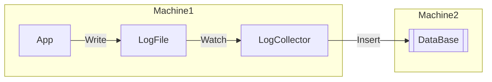
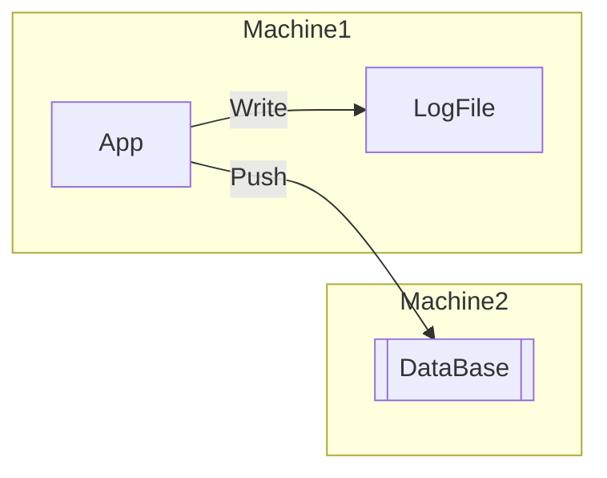
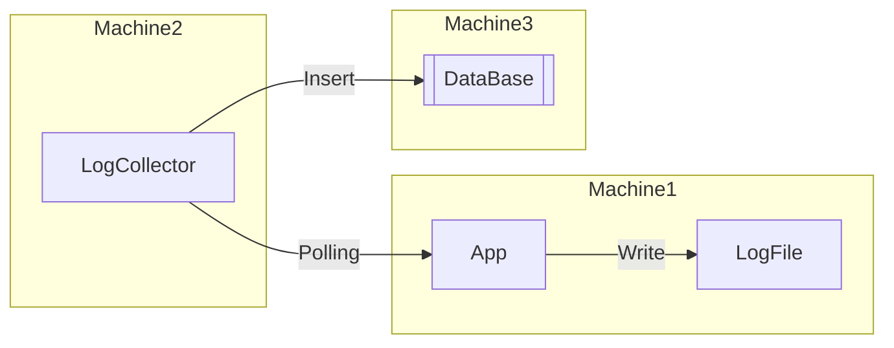

# Architecture

## Log Collecting

장점
- 어플리케이션 개발과 로그 수집의 관심사 분리

단점
- Log Collector 의 관리 포인트 추가

## Network Push

장점
- 어플리케이션 개발자 입장에서 직관적
- 로그 전송의 성공여부를 어플리케이션에서 판단

단점
- 어플리케이션 로직과 Push로직을 같은 프로세스에서 수행하여 영향도 증가
- 로그 전송으로 어플리케이션 부하, 병목이 생길 수 있음

## Network Polling

장점
- 어플리케이션 로직과 메트릭 수집의 관심사 분리
- 분산 환경, 컨테이너 환경, 자동화된 인프라 환경에서 사용성이 편하고, 확장성 높다
- 로그 보다 어플리케이션 Metric 수집에 적합

단점
- Polling 방식이기 때문에 순간의 정확한 정보를 보는데 부적합

